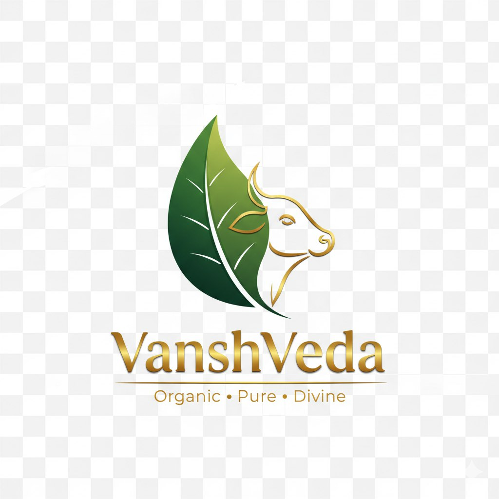

# 🌱 VanshVeda - Eco-Friendly Cow Dung Products

**प्राकृतिक जीवन शैली** | _Natural & Sustainable Living_

A comprehensive website showcasing premium eco-friendly cow-dung based products for sustainable living, featuring 100% natural, chemical-free solutions for modern homes and organic farming.



## 🚀 Project Overview

VanshVeda represents the perfect blend of traditional Indian wisdom and modern sustainability practices. Our website showcases a complete range of cow-dung based organic products designed for eco-conscious consumers and organic farmers.

### 🎯 Mission

To promote sustainable living through authentic, chemical-free products that benefit both people and the planet while preserving ancient Indian traditions.

## ✨ Features

### 🏠 **Website Sections**

- **🏡 Hero Section**: Engaging introduction with brand message
- **📖 About Us**: Company story and mission
- **🛍️ Products**: Comprehensive product showcase (6 categories)
- **🌟 Benefits**: 8 key benefits in perfect 4x2 grid layout
- **🎥 Process Video**: Custom video player with organic animations
- **❓ FAQ**: Bilingual Q&A section (Hindi & English)
- **📧 Contact**: Professional contact form with email integration guide
- **🦶 Footer**: Enhanced footer with navigation and badges

### 🎨 **Design Highlights**

- **🎨 Eco-Friendly Theme**: Green and yellow color palette
- **🌍 Bilingual Content**: Hindi & English throughout
- **📱 Fully Responsive**: Mobile-first design approach
- **✨ Smooth Animations**: Scroll-triggered effects and hover interactions
- **🎬 Video Integration**: Custom video player with controls
- **🎯 Professional Layout**: Clean, modern, and organized

### 🛠️ **Technical Features**

- **⚡ Pure HTML5/CSS3/JavaScript**: No frameworks needed
- **📱 Mobile Responsive**: Works on all device sizes
- **🚀 Fast Loading**: Optimized assets and code
- **♿ Accessible**: Focus states and proper ARIA labels
- **🔍 SEO Optimized**: Comprehensive meta tags and structure
- **📧 Contact Form**: Ready for backend integration

## 📁 Project Structure

```
vanshveda/
│
├── 📄 index.html                    # Main website file
├── 📝 README.md                     # Project documentation
├── 🚫 .gitignore                    # Git ignore rules
│
├── 📁 src/                          # Source code directory
│   ├── 📁 css/                      # Stylesheets
│   │   ├── 🎨 main.css             # Main styles (responsive)
│   │   └── 🎬 video.css            # Video player styles
│   │
│   ├── 📁 js/                       # JavaScript files
│   │   └── ⚡ main.js               # Interactive functionality
│   │
│   ├── 📁 images/                   # Image assets
│   │   ├── 🖼️ vanshveda-logo.png   # Brand logo (PNG)
│   │   └── 🖼️ logo.jpg             # Alternative logo (JPG)
│   │
│   └── 📁 videos/                   # Video files
│       └── 🎥 animate2-video.mp4    # Process demonstration video
│
├── 📁 assets/                       # Additional assets
├── 📁 docs/                         # Documentation files
└── 🗂️ index.html.backup            # Backup file
```

## 🛍️ Product Categories

### 1. 🌱 **Organic Fertilizers**

- Premium cow dung compost
- Liquid organic fertilizer
- Enriched soil conditioner

### 2. 🐛 **Bio-Pesticides**

- Natural pest control solutions
- Chemical-free plant protection
- Eco-friendly farming solutions

### 3. 🕯️ **Incense & Religious Items**

- Traditional dhoop sticks
- Cow dung diyas/lamps
- Sacred ceremony products

### 4. 🔥 **Cow Dung Cakes**

- Fuel cakes for cooking
- Religious ceremony use
- Traditional household fuel

### 5. 🧽 **Home Care Products**

- Natural cleaning solutions
- Chemical-free household items
- Eco-friendly alternatives

### 6. 🌿 **Miscellaneous**

- Traditional handicrafts
- Organic gardening supplies
- Sustainable lifestyle products

## 🌟 8 Key Benefits (Perfect 4x2 Grid)

### Row 1:

1. **🌍 Environmental Benefits** - Reduces pollution, promotes biodiversity
2. **💚 Health Benefits** - Chemical-free, safe for families
3. **🚜 Agricultural Benefits** - Improves soil fertility naturally
4. **💰 Economic Benefits** - Cost-effective sustainable solutions

### Row 2:

5. **🔬 Scientific Backing** - Research-validated traditional knowledge
6. **🏛️ Cultural Heritage** - Preserves ancient Indian traditions
7. **💡 Innovation** - Traditional wisdom meets modern technology
8. **🌍 Global Impact** - Contributing to worldwide sustainability

## 🎨 Design System

### 🎨 **Color Palette**

```css
--primary-green: #2d5016    /* Main brand color */
--soft-yellow: #f4e5a0      /* Accent color */
--cream: #f7f3e9            /* Light background */
--warm-beige: #e6d7c3       /* Text color */
--accent-green: #7fb069     /* Highlight color */
```

### 🔤 **Typography**

- **Hindi**: Noto Sans Devanagari (300, 400, 600, 700)
- **English**: Inter (300, 400, 500, 600, 700)
- **Headings**: Playfair Display (400, 600, 700)

### 📱 **Responsive Breakpoints**

- **Desktop**: 1200px+
- **Tablet**: 768px - 1199px
- **Mobile**: 320px - 767px

## 🚀 Getting Started

### 📋 Prerequisites

- Modern web browser (Chrome, Firefox, Safari, Edge)
- Basic understanding of HTML/CSS/JavaScript (for customization)
- Web server (for production deployment)

### 🔧 Installation

1. **Clone or Download**

   ```bash
   git clone [your-repo-url]
   cd vanshveda
   ```

2. **Open Locally**

   ```bash
   # Simply open index.html in your browser
   open index.html

   # Or use a local server (recommended)
   python -m http.server 8000
   # Then visit: http://localhost:8000
   ```

3. **Customize Content**
   - Edit `index.html` for content changes
   - Modify `src/css/main.css` for styling
   - Update `src/js/main.js` for functionality
   - Replace images in `src/images/`
   - Add your video to `src/videos/`

## 📧 Email Integration Setup

The contact form is currently in **demo mode**. To enable real email sending:

### Option 1: PHP Backend

```php
// contact.php
<?php
if ($_POST) {
    $to = "contact@vanshveda.com";
    $subject = $_POST['subject'];
    $message = $_POST['message'];
    $headers = "From: " . $_POST['email'];

    mail($to, $subject, $message, $headers);
    echo json_encode(['success' => true]);
}
?>
```

### Option 2: Node.js with Nodemailer

```javascript
const nodemailer = require("nodemailer");

const transporter = nodemailer.createTransporter({
  service: "gmail",
  auth: {
    user: "your-email@gmail.com",
    pass: "your-app-password",
  },
});
```

### Option 3: Third-Party Services

- **Formspree**: Simple form-to-email service
- **EmailJS**: Client-side email sending
- **SendGrid**: Professional email API
- **Mailgun**: Developer-focused email service

## 🌐 Deployment

### 🔒 **Static Hosting** (Recommended)

- **Netlify**: Drag & drop deployment
- **Vercel**: Git-based deployment
- **GitHub Pages**: Free hosting for public repos
- **Firebase Hosting**: Google's hosting solution

### 🖥️ **Traditional Hosting**

- Upload all files to your web server
- Ensure proper file permissions
- Configure domain and DNS settings
- Set up SSL certificate (recommended)

## 📱 Mobile Optimization

- ✅ Mobile-first responsive design
- ✅ Touch-friendly navigation
- ✅ Optimized images and assets
- ✅ Fast loading on mobile networks
- ✅ Proper viewport configuration
- ✅ Accessible form controls

## 🔍 SEO Features

- ✅ Comprehensive meta tags
- ✅ Open Graph and Twitter cards
- ✅ Semantic HTML structure
- ✅ Optimized images with alt text
- ✅ Proper heading hierarchy
- ✅ Schema markup ready
- ✅ Sitemap and robots.txt ready

## 🧪 Browser Support

| Browser | Version | Status             |
| ------- | ------- | ------------------ |
| Chrome  | 80+     | ✅ Full Support    |
| Firefox | 75+     | ✅ Full Support    |
| Safari  | 13+     | ✅ Full Support    |
| Edge    | 80+     | ✅ Full Support    |
| IE      | 11      | ⚠️ Limited Support |

## 🔄 Updates & Maintenance

### 🎯 **Regular Tasks**

- Update product information
- Add new testimonials
- Refresh images and videos
- Update contact information
- Monitor form submissions

### 📈 **Performance Optimization**

- Compress images before upload
- Minify CSS and JavaScript for production
- Enable gzip compression on server
- Set up proper caching headers
- Monitor loading speeds

## 🤝 Contributing

1. Fork the repository
2. Create a feature branch (`git checkout -b feature/amazing-feature`)
3. Commit changes (`git commit -m 'Add amazing feature'`)
4. Push to branch (`git push origin feature/amazing-feature`)
5. Open a Pull Request

## 📄 License

This project is proprietary to VanshVeda. All rights reserved.

## 📞 Support & Contact

- **Website**: [vanshveda.com](https://vanshveda.com)
- **Email**: contact@vanshveda.com
- **Phone**: +91 98765 43210
- **Address**: Delhi, India

## 🙏 Credits

- **Design**: Custom eco-friendly theme
- **Fonts**: Google Fonts (Noto Sans Devanagari, Inter, Playfair Display)
- **Icons**: Unicode emojis for maximum compatibility
- **Images**: Custom photography and logo design
- **Development**: Modern HTML5/CSS3/ES6 JavaScript

---

**Made with ♡ & sustainable care • VanshVeda**

_प्राकृतिक जीवन शैली - Natural & Sustainable Living_

🌱 100% Eco-Friendly • 🐄 Natural Cow Dung • ♻️ Sustainable Living
